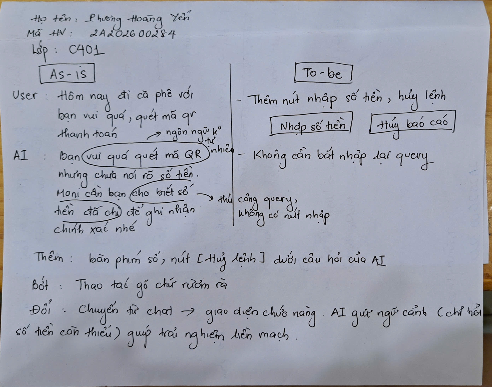

# Bài tập UX: phân tích sản phẩm AI thật

**Thời gian:** 40 phút | **Cá nhân** | **Output:** sketch giấy, nộp cuối bài

---

## Chọn 1 sản phẩm

| Sản phẩm | AI feature | Truy cập |
|----------|-----------|---------|
| MoMo — Trợ thủ AI Moni | Phân loại chi tiêu, chatbot tài chính | App MoMo |

---

## Phần 1 — Khám phá (15 phút)

**Trước khi dùng:** tìm hiểu sản phẩm marketing AI feature này thế nào — website, app store, bài PR. Sản phẩm hứa gì?
Momo makerting moni:
Nói chuyện tự nhiên như con người: Giao tiếp linh hoạt, không bị gò bó theo kịch bản có sẵn.

Cá nhân hóa sâu theo ngữ cảnh: Hiểu và dựa vào lịch sử hành động của người dùng trên MoMo để đưa ra phân tích, cảnh báo và gợi ý tài chính phù hợp.

Tối giản thao tác: Người dùng chỉ cần chat để hệ thống tự động ghi chép, phân loại và xuất báo cáo chi tiêu.

Tính cách "chuyên gia thân thiện": Định vị là "nhân vật phụ" thông thái, tỉ mỉ, kiên nhẫn hỗ trợ người dùng mà không phán xét.

An toàn dữ liệu: Bảo mật tuyệt đối mọi thông tin tài chính theo tiêu chuẩn quốc tế PCI DSS.

**Rồi dùng thử:** tải app / mở web, thử các tính năng AI. Quan sát kỹ: AI phản ứng thế nào? UI thay đổi gì? Có nút gì xuất hiện / biến mất?

AI trả lời thân thiện, ngôn ngữ tự nhiên

UI có thay đổi như hiện thông báo xác thực khoản chi tiêu đượ ghi lại

Xuất hiện các nút để truy vấn tổng chi tiêu, báo cáo tài chính hàng tháng

## Phần 2 — Phân tích 4 paths (10 phút)

Dùng framework 4 paths để mổ xẻ sản phẩm:

| Path | Câu hỏi | Trả lời |
|------|---------|---------|
| 1. Khi AI **đúng** | User thấy gì? Hệ thống confirm thế nào? | User thấy response trả về là ngôn ngữ tự nhiên, thân thiện. Chi tiêu được ghi lại vào sổ chi tiêu, có tính năng xuất tổng chi tiêu
| 2. Khi AI **không chắc** | Hệ thống xử lý thế nào? Im lặng? Hỏi lại? Show alternatives? | User biết bằng cách tra tổng chi tiêu và không thấy toàn bộ các khoản đã ghi nhận (dù có confirm đã ghi nhận). SỬa bằng cách nhắc AI. Tốn 1 bước và đã được ghi nhận bổ sung.
| 3. Khi AI **sai** | User biết bằng cách nào? Sửa bằng cách nào? Bao nhiêu bước? | Hỏi: "Hôm nay đi cafe vui ghê". Hệ thống rep: "Chưa nói rõ số tiền". Hỏi lại: "Moni cần bạn cho biết số tiền để ghi nhận chính xác"
| 4. Khi user **mất tin** | Có exit không? Có fallback (con người, manual)? Dễ tìm không? | Không exit. Tìm cách cứu (hủy thao tác gây sai). Không fallback qua con người, chỉ hỏi user các bước để hoàn thiện lại yêu cầu

**Tự phân tích:**
- Path nào sản phẩm xử lý tốt nhất? Tại sao?
Path 2 sản phẩm xử lý tốt nhất. Khi gặp 1 case mà AI không chắc vì không đúng thật sự với chủ đề là ghi nhận chi tiêu, hệ thống vẫn hỏi lại user để làm rõ và điều hướng qua nhiệm vụ chính của bot, không im lặng. Ngôn ngữ nhẹ nhàng, nhắc nhở user về nhiệm vụ chính của cuộc hội thoại
- Path nào yếu nhất hoặc không tồn tại?
Path 4 yếu nhất: không fallback qua người thật, yêu cầu người dùng confirm rồi mới xóa giao dịch bị ghi nhận sai
- Kỳ vọng từ marketing khớp thực tế không? Gap ở đâu?
+ Giao tiếp tự nhiên: khớp
+ Gap: thường xuyên thiếu ghi nhận hoặc ghi nhận sai dù đã xác nhận thêm khoản

## Phần 3 — Sketch "làm tốt hơn" (10 phút)

Chọn **1 path yếu nhất** mà mình tìm được. Sketch trên giấy:

- **As-is** (bên trái): user journey hiện tại → đánh dấu chỗ gãy
- **To-be** (bên phải): user journey đề xuất → vẽ kế bên
- Ghi rõ: thêm gì? Bớt gì? Đổi gì?

Không cần đẹp. Cần rõ.

!

## Phần 4 — Share + vote (5 phút)

Chia sẻ sketch với nhóm. Mỗi người trình bày ngắn (30 giây). Nhóm vote sketch hay nhất → **bonus điểm**.

---

## Nộp bài

Mỗi người nộp sketch giấy + ghi chú phân tích 4 paths. Đây là **điểm cá nhân**.

**Nice to have:** screenshot màn hình app + annotate (khoanh, ghi chú) chỗ hay / chỗ gãy. Nộp kèm sketch.

---

## Tiêu chí chấm (10 điểm + bonus)

| Tiêu chí | Điểm |
|----------|------|
| Phân tích 4 paths đủ + nhận xét path yếu nhất | 4 |
| Sketch as-is + to-be rõ ràng | 4 |
| Nhận xét gap marketing vs thực tế | 2 |
| **Bonus:** nhóm vote sketch hay nhất | +bonus |

---

*Bài tập UX — Ngày 5 — VinUni A20 — AI Thực Chiến · 2026*